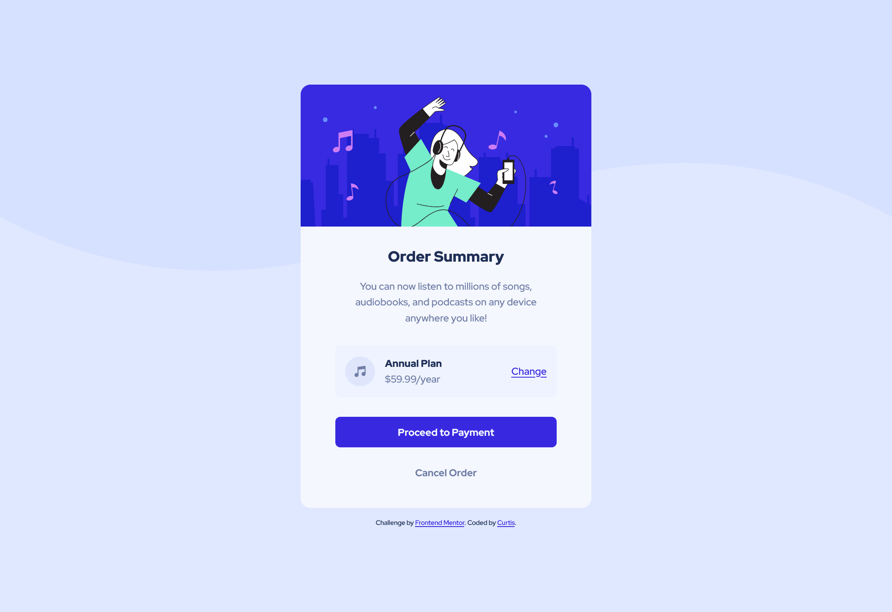
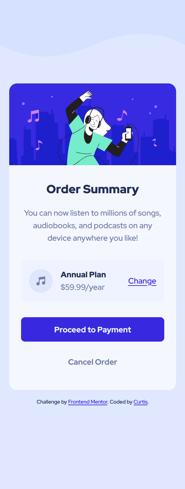
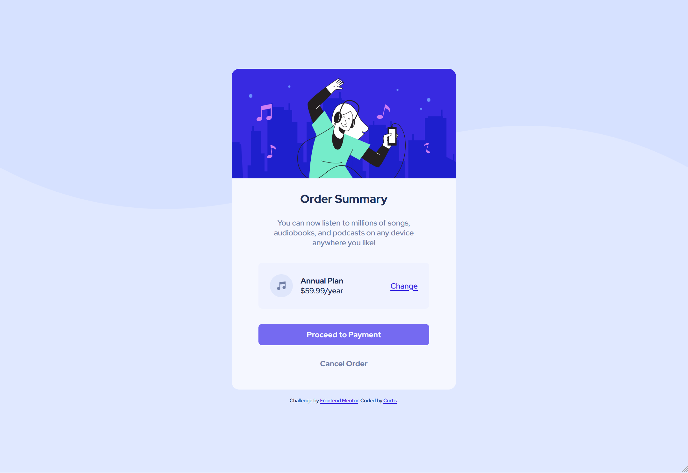

# Frontend Mentor - Order Summary Card solution

This is my solution to the [Order summary card challenge on Frontend Mentor](https://www.frontendmentor.io/challenges/order-summary-component-QlPmajDUj). Frontend Mentor challenges help you improve your coding skills by building realistic projects. 

### Please note that this project was developed with the skills I knew at the time. I did not go and Google search solutions at all. The project ended up beating me and you can read below for the reason.

## Overview:

### Live Demo:
https://mvpcurtis.github.io/order-summary-component/

### Screenshots:

### Built With:
- Semantic HTML5 markup
- CSS custom properties
- Flexbox

### What I learned:
Whilst building this project, I was struggling with the responsiveness. Because the container was using percentages, whenever I'd shrink the webpage for a mobile view, the content was instantly start shrinking instead of eating the space between the content and the edge of the webpage. I was stuck on this for a good while until I came back and changed the container to a "max-width: 469px". 

### Continued Development:
As stated above, I struggled with sizing the container for responsive designs and that is something I'm going to look into and get better at. Another thing that I struggled with and it beat me was the background-images. There was a mobile illustration and a desktop illustration and I couldn't figure out how to change them based on the screensize. Again, HTML images are something that I need to work on.

## Author:
- Portfolio: [Curtis](https://curtisbowen.xyz/)
- Frontend Mentor - [@mvpcurtis](https://frontendmentor.io/profile/mvpcurtis/)
